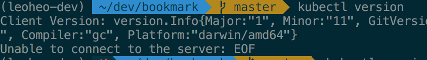
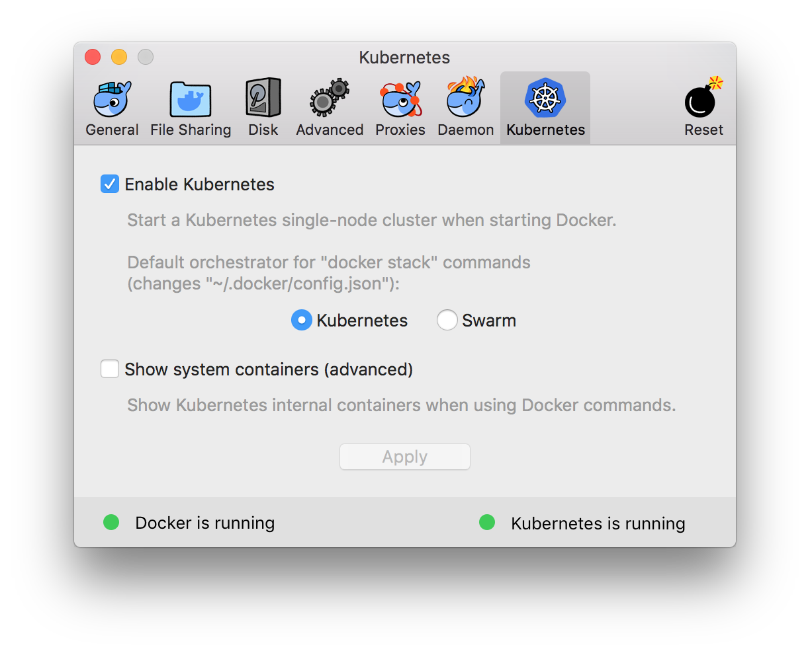
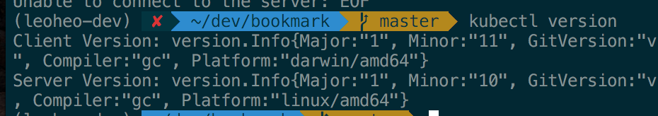
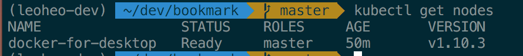

## kubectl cluster master api server
kubectl을 설치하고 `kubectl version`을 하게 되면 아래와 같이 나온다.

Client는 정상적으로 설치되어 버전이 출력이 되는데 kubectl이 접속할 대상서버(K8s 클러스터의 마스터 API Server)가 존재하지 않기 때문에 이런 문제가 발생한다.

이걸 해결 하기 위해서는 K8s 클러스터 환경을 구성해야 하는데 GCP, AWS 같은 클라우드는 과금의 부담이 있기 때문에 개념을 익히는 동안에는 로컬 환경을 구성해서 테스트 해보는 것이 좋겠다고 생각했다.

로컬환경을 구성하는 가장 쉬운 방법은 [Docker-for-mac Edge](https://download.docker.com/mac/edge/24545/Docker.dmg) 을 설치해서 k8s를 구동하는것이다.

> Stable 버전의 Docker를 Edge 버전으로 전환할 경우 로컬에 받아놓은 이미지가 전부 삭제될 수 있음으로 Edge버전 설치 시 주의해야 한다.

설치를 완료하면 아래와 같이 기존에 안보이던 메뉴가 하나 더 생긴다.

Enable를 해주고 다시 terminal에서 `kubectl version`을 하게 되면 아래와 같이 나온다.

그리고 node를 확인해보면 아래와 같이 나온다.

## Reference
- [Kubernetes 01 – Pod](https://blog.2dal.com/2018/03/28/kubernetes-01-pod/)