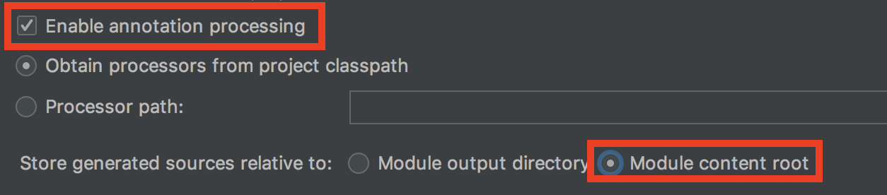

# Spring boot에서 QueryDSL Error Handling

- Intellij(이하 idea)에서 QueryDSL `Duplicate clsss QFoo.class` 오류 해결방법

## 원인
- QFile이 Build할때 2군데(generated, java)모두 생성이 되서 duplicate error가 나는 경우

## 해결방법

### idea Project Setting
1. Preferenece를 연다. (`cmd + ,`)
2. 검색창에 `annotation processors`를 검색해서 `Build, Execuetion, Deployment > Compiler > Annotaion Processors`로 간다.
3. `Enable annotaion processing`를 체크하고 Store generated source relative to에서 `Module Content root`를 선택한다.



### idea build.gradle 설정

```groovy
// build.gradle

apply plugin: 'idea'

plugins {
     id 'idea'
}

idea {
    module {
        sourceDirs += file('src/main/generated')
        generatedSourceDirs += file('src/main/generated')
    }
}
```

### QueryDSL QFile 만들기
- idea에서 QFile을 만드는 방법은 다양하게 있는데 그중에 한가지인 build.gradle에 gradle task로 만들어서 돌리는 방법을 소개한다.

```groovy
// build.gradle

task generateQueryDSL(type: JavaCompile, group: 'build') {
    source = sourceSets.main.java
    classpath = configurations.compile
    options.compilerArgs = [
            "-proc:only",
            "-processor", "com.querydsl.apt.jpa.JPAAnnotationProcessor"
    ]
    destinationDir = file('./src/main/generated')
}
```

최종적으로 build.gradle 모습

```groovy
apply plugin: 'idea'

plugins {
     id 'idea'
}

idea {
    module {
        sourceDirs += file('src/main/generated')
        generatedSourceDirs += file('src/main/generated')
    }
}

task generateQueryDSL(type: JavaCompile, group: 'build') {
    source = sourceSets.main.java
    classpath = configurations.compile
    options.compilerArgs = [
            "-proc:only",
            "-processor", "com.querydsl.apt.jpa.JPAAnnotationProcessor"
    ]
    destinationDir = file('./src/main/generated')
}
```

### 실행절차
1. gradle clean
2. gradle generateQueryDSL 실행
3. application 실행